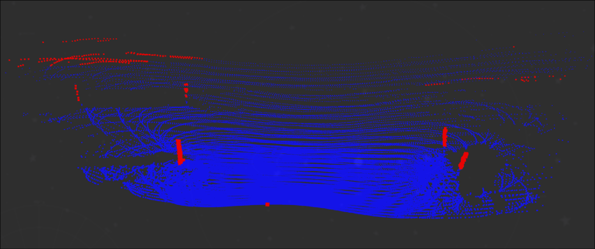
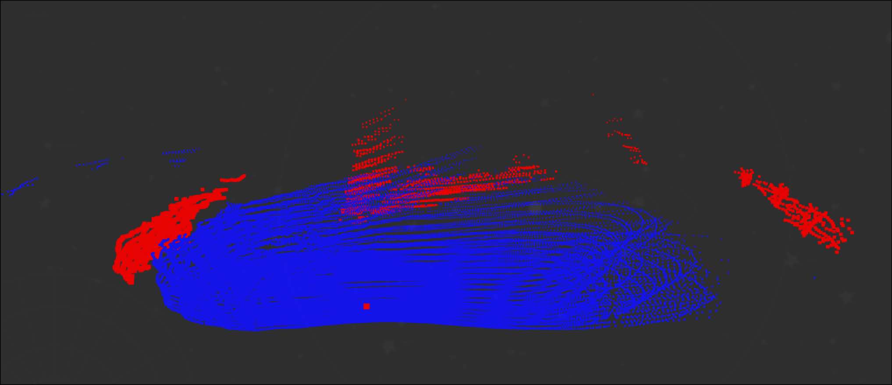

# DECODA Systems Engineer Skill Test

## The Challenge

Implement a point cloud segmentation node with the following specification:

1. Subscribe to the /lidar topic (sensor_msgs/PointCloud2).
2. Segment the point cloud into ground and non-ground (obstacle) points.
3. Publish the results to two topics:
• /ground - drivable surface
• /nonground - potential obstacles
4. Visualize the results, displaying ground and obstacles in distinct colours (e.g., brown for ground,
purple for obstacles). RViz2, Foxglove, or any other visualiser is fine.

## Application Report

### Build Instructions

The below instructions detail how to build the project in a Unix terminal

```bash
git clone https://github.com/LucaLubrano/decoda-skill-test
cd ~/decoda-skill-test/ros_ws
colcon build --packages-select ground_segmenter
```

The below instructions detail how to run the project in a Unix terminal

#### Terminal 1

This terminal runs the ground segmentation node which subscribes to /lidar and publishes /ground_points and /obstacle_points

```bash
cd ~/decoda-skill-test/ros_ws
ros2 run ground_segmenter ground_segmentation --ros-args --params-file src/ground_segmenter/params/ground_segmenter_params.yaml
```

#### Terminal 2

This terminal runs the LiDAR health check node which does a basic health check whether the /lidar topic is being published to

```bash
cd ~/decoda-skill-test/ros_ws
ros2 run ground_segmenter lidar_checker 
```

#### Terminal 3

This terminal runs the ros bag containing the /lidar playback

```bash
cd ~/decoda-skill-test/
ros2 bag play data/lidar/
```

### Design Overview

The design philospohy for this project was to use random sample consensus (RANSAC) to segment the ground and obstacle objects based on conformance to planes. This was chosen since when I inspected the raw LiDAR point cloud it was evident that the data collected had clear geometric features. These features being a road, and two angled walls opposing the road, the obstacles themselves appeared to be clearly visible posts which the RANSAC algorithm is well suited to find.



In this implementation I build from first principles a single plane RANSAC algorithm. I do this to demonstrate my programatic skill set and understanding of the underlying mathematics involved in these kinds of algorithms (coming from my dual degree in mathematics). As such, the only external dependencies that are used is point cloud library. The single plane implementation is a showcase model, and confuses features towards the extremity of the frame as obstacles.



However, it captures all obstacles throughout the drive and we can reduce the inclusion of gradient road surfaces by trivially including extra RANSAC layering.

I chose the RANSAC algorithm as it takes advantage of the stark geometric features within the environment. Since, DECODA has a strong focus on mining environments, which are often structured especially within heavy haulage routes, this was determined as a suitable method to choose. Other methods that were researched were voxel-based segmentation and slope evaluation. A voxel-based approach was not chosen as it was deemed unnecessarily complex for the features of the data. A slope evaluation for determining the obstacles was deemed unsuitable for a mining environment as haulage roads may have vertical faces which could conflict with the obstacle indetification criterian.

<video width="320" height="240" controls>
  <source src="./images/full_run.mp4" type="video/mp4">
</video>


### Assumptions

The most obvious assumption that I made for this project was that the *obstacles* in the data were the posts. One could also make the assumption that the edges of the road are obstacles, as they are presumably an undesirable location for the haulage trucks to access. By taking both of these assumptions into account, the current solution is a minimal and simplistic solution to the problem.

Should we assume that the *obstacle* is only the posts, our solution fails to read the edges of the road as obstacles. There are several steps that can be immediately taken to solve this problem. The solution to this assumption violation is relatively simple since the road edges are also planar.

### AI/LLM Usage

Throughout the process of making of this code base, Claude was used to assist in research for algorithms that would be suitable for the type of input data.

### Improvements

There are improvements that I would make to this project given more time. I would have liked to implement two additional features to my algorithm. Firstly, the addition of a three plane RANSAC algorithm approach would have been a quick and entirely first principle solution to removing the road edges as obstacles. Including this would also be relatively simple since I have already written the algorithms of the solution, but would just need to layer the logic more in the Node.

Secondly, I would include a Euclidean cluster extraction algorithm. What this would do is search through the outlier points (the obstacle layer) and attempt to find clusters of points within a certain (euclidean) distance. Obviously, for post style obstacles this is a clearly advantages method for segmenting these kind of obstacles.

### Reliability Extension

Within this project, I aimed to demonstrate first principle knowledge of coding practices and abilities. As such, I did not focus heavily on health monitoring and reliability as these features are readily availble through ROS2 tools. I did however, implement a basic LiDAR check that queries the /lidar topic to determine when the topic is no longer sending live data. This is extremely important in remote heavy haulage operations as there are serious consequences should these trucks not operate correctly. As such, we wish to be immediately notified should they be moving and not receiving frequent enough sensor information about their external environment.

## Prerequisites

| Constraint | Detail |
| --- | --- |
| OS | Ubuntu 24.04 |
| Middleware | ROS2 Jazzy |
| Language | C++ |
